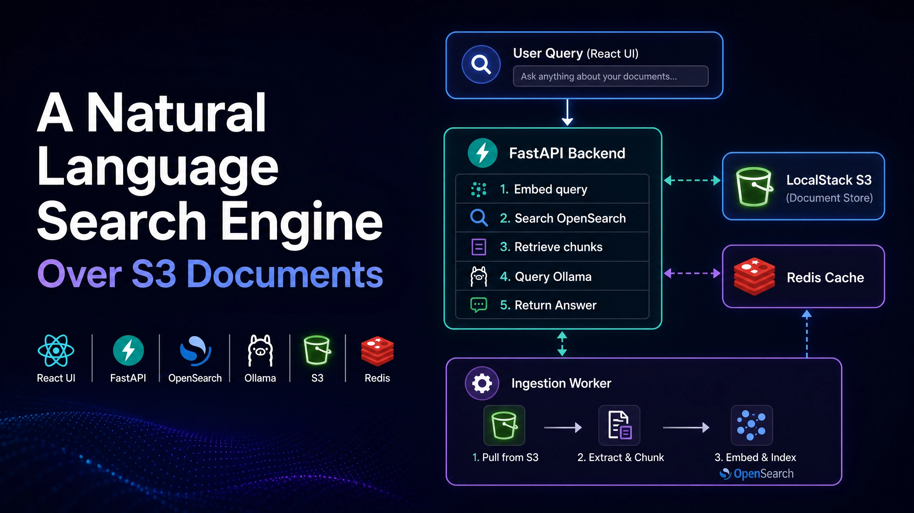

# I Built a Natural Language Search Engine Over S3 Documents as a Learning Project — Here's Everything I Learned

*A curious developer's journey into LLM integration and RAG: wiring FastAPI, OpenSearch, Ollama, and LocalStack into a fully local pipeline — and all the painful bugs in between.*

---

## The Problem — and Why I Built This

I'm not an ML engineer. I'm a backend developer who got curious about LLMs and wanted to understand RAG from the inside — not by reading papers, but by building something real with it.

The trend is hard to ignore: every team is asking how to make their internal documents searchable with AI. The question I kept hearing was *"Can we just ask our S3 bucket a question?"* I didn't know the answer, so I decided to find out by building it myself.

The concrete problem I picked: your team dumps hundreds of PDFs, Word docs, and text files into S3 buckets. Finding anything useful means either knowing the exact filename or running keyword `grep`-style searches that miss meaning entirely. You want to ask *"What did the Q3 report say about churn?"* and get an actual answer — not a list of files.

That's the problem I set out to solve out of pure curiosity: a **Retrieval-Augmented Generation (RAG) system** that sits on top of Amazon S3, understands natural language queries, and synthesises answers from your documents using a local LLM. No OpenAI API key. No data leaving your machine. No ML background required to get started.

Here's the architecture I ended up with, what broke along the way, and the exact lessons I'd give myself at the start.

---

## Use Cases

This system is general enough to fit several real workflows. Here are the ones that motivated the build and where it performs best:

**Legal & Compliance Teams**
Contracts, NDAs, regulatory filings, and policy documents accumulate fast. A compliance officer asking *"Which contracts include a limitation of liability clause above $500K?"* currently means manually opening dozens of PDFs. With this system, the question goes directly to the search engine and the answer cites the exact clause and source document.

**Internal Knowledge Bases**
Engineering runbooks, architecture decision records, post-mortems, and onboarding docs live in S3 but nobody reads them because nobody can find them. A new engineer asking *"How do we handle database migrations in production?"* gets an answer synthesised from three different runbooks rather than a list of filenames to guess through.

**Financial & Analyst Workflows**
Quarterly reports, earnings call transcripts, and market research PDFs. Analysts spend hours cross-referencing documents for a single data point. Asking *"What was the gross margin trend across Q1–Q3 2023 in the earnings reports?"* becomes a seconds-long query instead of an afternoon task.

**HR & People Operations**
Job descriptions, interview feedback forms, performance reviews, and policy handbooks. An HR manager asking *"What does our remote work policy say about equipment reimbursement?"* gets a direct answer without hunting through a policy PDF from three versions ago.

**Research & Academic Use**
A corpus of academic papers in S3. A researcher asking *"What methods have been used to measure transformer attention sparsity?"* retrieves and synthesises findings across papers they may not have individually read — a genuine literature review assist rather than a keyword search.

**Where it works best:** corpora where the answer to a question lives in a specific passage of a specific document. The system excels at factual retrieval and localised synthesis. It is less suited to questions requiring deep cross-document reasoning or quantitative analysis across many data points simultaneously — those are areas where the top-5 chunk retrieval window becomes a limiting factor.

---

## Architecture Overview

```
User Query (React UI)
        │
        ▼
   FastAPI Backend
   ┌──────────────────────────────────────┐
   │  1. Embed query → vector             │
   │  2. Search OpenSearch (kNN)          │
   │  3. Retrieve top-k chunks            │
   │  4. Send chunks + query → Ollama     │
   │  5. Return generated answer          │
   └──────────────────────────────────────┘
        │                    │
   LocalStack S3        Redis Cache
   (document store)    (query cache)
        │
   Ingestion Worker
   (on upload or schedule)
   ┌──────────────────────────────────────┐
   │  1. Pull file from S3                │
   │  2. Extract text                     │
   │  3. Chunk text                       │
   │  4. Embed chunks → vectors           │
   │  5. Index into OpenSearch            │
   └──────────────────────────────────────┘
```

**Stack at a glance:**

| Layer          | Technology                    |
|----------------|-------------------------------|
| Frontend       | React + Vite + Axios          |
| Backend API    | FastAPI + httpx               |
| Vector store   | OpenSearch (kNN index)        |
| Embeddings     | sentence-transformers         |
| Local LLM      | Ollama (llama3)               |
| Document store | LocalStack S3 (AWS emulation) |
| Cache          | Redis                         |
| Infrastructure | Docker Compose + Makefile     |

Everything runs locally in Docker. The only cloud service involved is the real AWS S3 interface — emulated by LocalStack so the code works identically against real AWS in production.

---

## How It Works — End to End

### 1. Document Ingestion

When a file lands in S3 (via upload or a watched prefix), the ingestion worker:

1. Downloads the file from LocalStack using boto3
2. Extracts raw text (PyMuPDF for PDFs, python-docx for Word, plain read for `.txt`)
3. Splits text into ~512-token overlapping chunks
4. Embeds each chunk with `sentence-transformers/all-MiniLM-L6-v2`
5. Indexes each chunk as an OpenSearch document with its vector, source file key, and chunk index

The OpenSearch index uses the `knn_vector` field type with cosine similarity:

```json
{
  "settings": { "index.knn": true },
  "mappings": {
    "properties": {
      "embedding": {
        "type": "knn_vector",
        "dimension": 384,
        "method": {
          "name": "hnsw",
          "space_type": "cosinesimil",
          "engine": "lucene"
        }
      },
      "text": { "type": "text" },
      "s3_key": { "type": "keyword" },
      "chunk_index": { "type": "integer" }
    }
  }
}
```

### 2. Query Flow

When the user submits a question:

1. FastAPI embeds the query with the same model used for ingestion
2. Runs a kNN search against OpenSearch to retrieve the top-5 most semantically similar chunks
3. Checks Redis — if this exact query was answered in the last hour, return the cached response immediately
4. Otherwise, constructs a prompt with the retrieved chunks as context and calls Ollama (`llama3`)
5. Streams the generated answer back to the frontend; caches it in Redis

The prompt template is deliberately minimal:

```
You are a helpful assistant. Answer the question using ONLY the context below.
If the context doesn't contain the answer, say so.

Context:
{chunk_1}
---
{chunk_2}
---
...

Question: {user_query}
Answer:
```

### 3. Frontend

A single-page React app: a search box, a results panel showing the generated answer, and a source panel showing which document chunks the answer drew from. Axios calls the FastAPI `/query` endpoint with a 120-second timeout (necessary for local Ollama inference on CPU).

---

## What Broke and What I Learned

This section is the real article. The architecture diagram above looks clean in hindsight. Getting there was not.

---

### Bug 1 — LocalStack S3 checksum rejection

**Symptom:** All `PutObject` calls to LocalStack failed with:

```
An error occurred (InvalidRequest) when calling the PutObject operation:
The request was rejected because it contained an unsupported checksum header.
```

**Cause:** Modern versions of boto3 default to sending `x-amz-checksum-*` headers. LocalStack free tier doesn't support them.

**Fix:** Set one environment variable in every container that touches S3:

```
AWS_REQUEST_CHECKSUM_CALCULATION=when_required
```

No code change. No dependency change. One env var, problem gone. Add it to `docker-compose.yml` under every relevant service's `environment` block.

---

### Bug 2 — PyTorch / NumPy version conflict destroying the Docker build

**Symptom:** The ingestion worker image built fine but crashed at runtime:

```
ImportError: numpy.core.multiarray failed to import
```

**Cause:** `pip install -r requirements.txt` installed NumPy 2.x, which is binary-incompatible with PyTorch 2.x builds that expect NumPy 1.x.

**Fix:** In the `Dockerfile` for the ingestion worker, pin and install NumPy and Torch *before* the requirements file so pip's resolver can't override them:

```dockerfile
RUN pip install "numpy<2" "torch==2.3.1" --index-url https://download.pytorch.org/whl/cpu
RUN pip install -r requirements.txt
```

Order matters. The two-stage install gives pip a pinned baseline it respects.

---

### Bug 3 — Stale OpenSearch records silently skipping re-ingestion

**Symptom:** Updated a document in S3. Re-ran ingestion. No change in search results. No error.

**Cause:** The ingestion worker checked whether a document record existed in OpenSearch before processing. But the check was: *"does any document with this s3_key exist?"* — not *"does this document have chunks indexed?"* A prior failed ingestion had written the document record but zero chunks. The worker saw the record and skipped the file.

**Fix:** Change the skip condition to check `document_chunk_count > 0`:

```python
# Before (wrong)
if opensearch.exists(index="documents", id=s3_key):
    continue

# After (correct)
doc = opensearch.get(index="documents", id=s3_key, ignore=404)
if doc and doc["_source"].get("chunk_count", 0) > 0:
    continue
```

Always verify the *substance* of existing records, not just their existence.

---

### Bug 4 — Makefile glob expansion breaking `make reload`

**Symptom:** `make reload SVC=ingestion-worker` worked. `make reload SVC=*` exploded with shell errors.

**Cause:** The Makefile passed `$(SVC)` directly into a shell command that used it in a glob context. The shell expanded `*` before Docker Compose saw it.

**Fix:** Quote the variable in the Makefile recipe:

```makefile
reload:
    docker compose restart "$(SVC)"
```

Single quotes don't work here (Make processes them differently). Double-quoting the variable in the shell command prevents glob expansion.

---

### Bug 5 — Axios timeout causing silent query failures

**Symptom:** Queries against short documents returned answers. Queries against long documents returned nothing — no error, no timeout message, just an empty result.

**Cause:** Axios default timeout is 0 (no timeout on the browser side), but the FastAPI client used `httpx` with a 30-second default to call Ollama. Local llama3 on CPU takes 60–180 seconds for long contexts.

**Fix:** Set explicit timeouts on both ends:

- `httpx` client in FastAPI: `httpx.AsyncClient(timeout=180.0)`
- Axios in the frontend: `axios.post('/query', payload, { timeout: 120000 })`

120 seconds on the frontend, 180 on the backend — gives the backend buffer to finish even if the browser is impatient.

---

### Bug 6 — `awslocal` CLI not available in CI / clean environments

**Symptom:** Setup scripts using `awslocal s3 mb ...` failed on machines without the `awslocal` wrapper installed.

**Fix:** Replace every `awslocal` call with the standard `aws` CLI plus an explicit endpoint flag:

```bash
aws --endpoint-url=http://localhost:4566 s3 mb s3://my-documents
```

More verbose, but works anywhere the standard AWS CLI is installed. Add `AWS_DEFAULT_REGION=us-east-1` and dummy credentials to the shell environment for LocalStack:

```bash
export AWS_ACCESS_KEY_ID=test
export AWS_SECRET_ACCESS_KEY=test
export AWS_DEFAULT_REGION=us-east-1
```

---

## Key Design Decisions Worth Calling Out

**Why OpenSearch over Pinecone/Weaviate/Qdrant?**
I wanted a single Docker image that handles both keyword fallback and vector search. OpenSearch's kNN plugin gives both. In production you'd evaluate managed alternatives, but locally OpenSearch is hard to beat for a single `docker compose up`.

**Why sentence-transformers over OpenAI embeddings?**
Zero cost, zero latency beyond the first inference, zero data leaving the machine. `all-MiniLM-L6-v2` is 80 MB and runs in under 100ms per chunk on CPU.

**Why Redis for caching?**
The same query (especially in a team setting) gets asked repeatedly. Ollama inference on CPU is 60–180 seconds. Redis TTL-based caching turns the second-and-subsequent answers into sub-100ms responses. The cache key is a SHA256 hash of the query string.

**Why LocalStack instead of a dev S3 bucket?**
No AWS account needed. No accidental charges. Identical boto3 API surface. The one tradeoff: LocalStack free tier has the checksum bug described above — solved by the environment variable.

---

## The Developer Loop

Hot-reloading individual containers without restarting the whole stack:

```bash
# Rebuild and restart just one service
make reload SVC=ingestion-worker

# Tail logs for a service
make logs SVC=api

# Run ingestion manually against a specific S3 prefix
make ingest PREFIX=reports/2024/
```

The `make reload` pattern — rebuild image, `docker compose up -d --no-deps --force-recreate <svc>` — is far faster than `docker compose down && up` for iterative development.

---

## Results

On a corpus of ~200 documents (mix of PDFs and Word files, ~50MB total):

- **Ingestion time:** ~4 minutes (CPU-only, single worker)
- **Query latency (cache miss):** 45–150 seconds (Ollama on CPU)
- **Query latency (cache hit):** < 200ms
- **Answer quality:** Accurate for specific factual questions; degrades on questions requiring synthesis across many documents (expected for top-5 chunk retrieval)

---

## What I'd Do Differently

1. **GPU for inference.** Ollama on CPU is workable for demos, unusable for teams. A single consumer GPU (RTX 3080+) drops latency to 3–8 seconds.

2. **Reranking.** Returning the top-5 kNN chunks by cosine similarity often surfaces marginally relevant chunks. A cross-encoder reranker (e.g. `ms-marco-MiniLM-L-6-v2`) as a second-pass filter improves answer quality meaningfully.

3. **Hybrid search.** Pure vector search misses exact-match cases (product codes, names, dates). OpenSearch supports BM25 + kNN hybrid queries natively — worth enabling.

4. **Chunk metadata.** Storing page number, section heading, and document title alongside each chunk makes the source citations far more useful to the end user.

5. **Streaming responses.** The frontend currently waits for the full Ollama response before rendering. Streaming would make the UX feel much faster even on slow hardware.

---

## Running It Yourself

```bash
git clone https://github.com/your-repo/s3-rag
cd s3-rag

# Start all services
docker compose up -d

# Create the LocalStack S3 bucket
aws --endpoint-url=http://localhost:4566 s3 mb s3://documents

# Upload a test document
aws --endpoint-url=http://localhost:4566 s3 cp ./sample.pdf s3://documents/

# Trigger ingestion
make ingest

# Open the UI
open http://localhost:5173
```

The full stack — LocalStack, OpenSearch, Redis, Ollama, FastAPI, and the React frontend — comes up with a single `docker compose up`. First run pulls ~6 GB of images and the llama3 model; subsequent starts are fast.

---

## Closing Thoughts

I started this project knowing how to write APIs and work with AWS. I did not start it knowing what a kNN index was, what "cosine similarity" meant in practice, or why chunking strategy matters for answer quality. I know all of those things now — not because I read about them, but because each one broke something and forced me to understand it.

That's the honest reason to build something like this as a learning project: the bugs teach you more than the tutorials do.

The hardest part was not the RAG architecture — that's well-documented territory. It was the integration layer: environment variables that don't exist, dependency version matrices that fight each other, and silent failures that look like logic bugs but are actually plumbing bugs.

If I had to distill it to three rules for anyone starting a similar learning project:

1. **Validate substance, not existence** — a record in a store is not proof of a complete record.
2. **Set timeouts explicitly everywhere** — defaults are built for fast APIs, not local LLM inference.
3. **Pin dependencies before installing requirements** — pip's resolver will pick the wrong versions if you give it freedom to choose.

The project is entirely local, entirely free to run, and the same boto3 code that talks to LocalStack will talk to real S3 with a one-line endpoint change. If you're curious about LLMs and RAG and learn best by breaking things, this is a worthwhile stack to break.

---

*Tags: Python, Machine Learning, AWS, Docker, NLP, RAG, OpenSearch, FastAPI*

---

## Medium Public Post
You can also check it out on medium: [A Natural Language Search Engine Over S3 Documents](https://medium.com/@towfiq106/a-natural-language-search-engine-over-s3-documents-d6321704290d?sharedUserId=towfiq106)